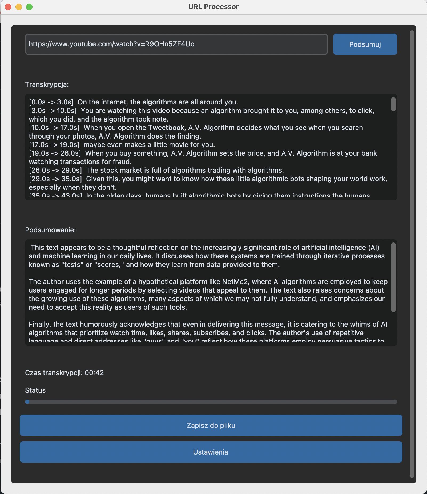

# YapperGUI



YapperGUI is a powerful desktop application that transcribes YouTube videos and generates summaries using AI. It combines the power of OpenAI's Whisper model for transcription and Ollama's local LLM for summarization.

## Features

- 🎥 YouTube video transcription
- 🤖 AI-powered summarization
- 🌍 Automatic language detection
- ⚡ GPU acceleration support
- 🎯 Timestamp support
- ⚙️ Configurable model settings
- 📝 Save transcriptions and summaries

## Requirements

- Python 3.8+
- FFmpeg
- CUDA-compatible GPU (optional, for faster processing)
- Ollama with mistral model installed

## Installation

1. Clone the repository:

```bash
git clone https://github.com/yourusername/yappergui.git
cd yappergui
```

2. Install dependencies:

```bash
pip install -r requirements.txt
```

3. Install Ollama and the mistral model:

```bash
# Install Ollama (macOS)
curl https://ollama.ai/install.sh | sh

# Pull the mistral model
ollama pull mistral
```

4. Run the application:

```bash
python main.py
```

## Usage

1. Launch the application
2. Paste a YouTube URL into the input field
3. Click "Podsumuj" to start processing
4. Wait for the transcription and summary to complete
5. Use the "Save to File" button to save the results

## Configuration

You can configure various settings through the Settings menu:

- Whisper Model Size: tiny, base, small, medium, large, large-v2
- Processing Device: CPU or CUDA
- FFmpeg Path
- Timestamp Display

## Project Structure

- `main.py` - Application entry point
- `gui.py` - Main GUI implementation
- `audio_processor.py` - YouTube audio download and processing
- `transcription.py` - Whisper model transcription
- `settings.py` - Settings window and configuration
- `config.py` - Configuration management
- `logger.py` - Logging system
- `utils.py` - Utility functions

## Error Handling

The application includes comprehensive error handling for common issues:

- Network connectivity problems
- FFmpeg missing or misconfigured
- GPU/CUDA issues
- File system permissions
- Invalid YouTube URLs

## Logging

Logs are stored in the `logs` directory with the following format:

- Daily log files: `yapper_YYYYMMDD.log`
- Both console and file logging
- Different log levels (DEBUG, INFO, ERROR)

## Contributing

1. Fork the repository
2. Create a feature branch
3. Commit your changes
4. Push to the branch
5. Create a Pull Request

## License

This project is licensed under the MIT License - see the LICENSE file for details.
